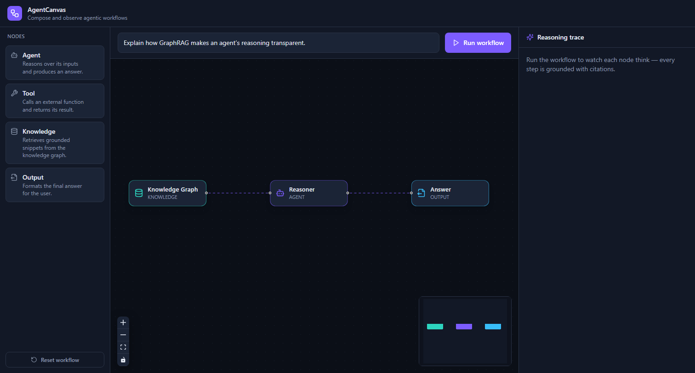

# AgentCanvas


A Vue 3 + VueFlow studio for **composing and observing agentic workflows**. Add agent, tool, and knowledge-graph nodes to a canvas, wire them together, tune each node in the inspector, then run the workflow and watch every node _think_ — each reasoning step streams in live and is grounded with citations, so the model's "thought process" is transparent instead of a black box.

Built to mirror the real shape of an agentic platform: a **graph- and canvas-heavy frontend** over an **event-streaming Node.js + TypeScript backend**, joined by **explicit schema contracts**.



## Stack

| Layer    | Tech                                                                                                                     |
| -------- | ------------------------------------------------------------------------------------------------------------------------ |
| Frontend | **Vue 3 (Composition API, `<script setup>`)**, **TypeScript (strict)**, **VueFlow**, Pinia, Tailwind v4, Lucide          |
| Backend  | **Node.js + TypeScript**, Hono, **Zod** schema contracts, Server-Sent Events                                             |
| Agent    | Topological node execution, streaming reasoning + citations; real **Anthropic Claude** streaming or a deterministic mock |

## Why it's built this way

- **Schema contracts (`server/src/agent/schema.ts`)** are the single source of truth for the language agents and humans speak — the workflow graph shape and the discriminated-union `RunEvent` stream. The Vue app mirrors these types.
- **The agent loop never touches the transport.** `runWorkflow` emits typed events into a sink; the HTTP layer drains them onto an in-order SSE channel so fast live-streaming deltas can't interleave.
- **One custom VueFlow node, catalog-driven.** Node kinds are data (`lib/nodeCatalog.ts`), not four copy-pasted components.
- **Select a node to edit it.** The inspector edits a node's label and an agent's system prompt; the prompt is the real instruction the agent reasons with (and is reflected in the mock too), so the control isn't cosmetic.
- **Runs with zero setup.** No API key → a deterministic mock agent streams scripted reasoning + grounded snippets, so the canvas is fully demoable offline and at no cost. Add a key to swap in real Claude streaming.

## Run it

```bash
npm install            # installs web + server workspaces
cp .env.example .env   # optional — add ANTHROPIC_API_KEY for the live agent
npm run dev            # web on :5173, server on :8787 (Vite proxies /api)
```

Open http://localhost:5173, edit the question in the toolbar, and hit **Run workflow**.

```bash
npm run build          # type-check + build both workspaces
npm run typecheck      # strict type-check only
```

## Layout

```
agentcanvas/
├─ server/                 # Node.js + TypeScript agent backend
│  └─ src/
│     ├─ index.ts          # Hono app + /api/run SSE endpoint
│     └─ agent/
│        ├─ schema.ts      # Zod schema contracts (source of truth)
│        ├─ tools.ts       # knowledge-graph retrieval tool
│        └─ loop.ts        # topological run loop + Claude streaming / mock
└─ web/                    # Vue 3 + VueFlow studio
   └─ src/
      ├─ components/        # Canvas, NodePalette, Toolbar, Inspector, RunPanel, nodes/BaseNode
      ├─ stores/workflow.ts # Pinia: graph state + selection + run orchestration
      ├─ lib/               # SSE client + node catalog
      └─ types/workflow.ts  # client mirror of the schema contracts
```

## License

[MIT](LICENSE) © Pyae Sone (Seon) — [github.com/soneeee22000](https://github.com/soneeee22000)
