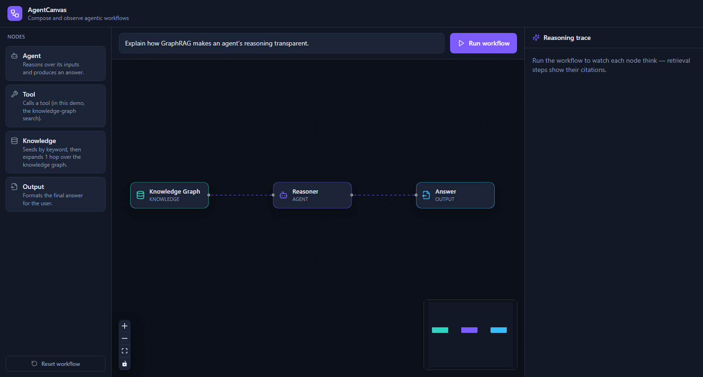
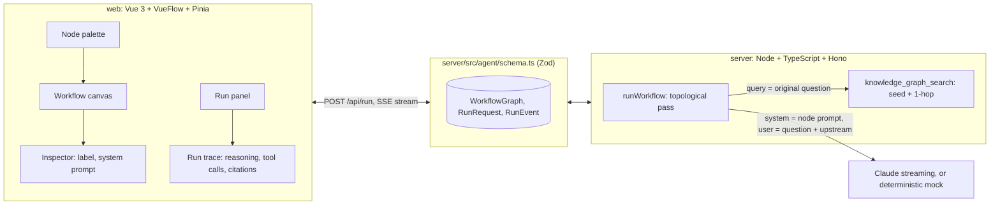

# AgentCanvas

A Vue 3 + VueFlow studio for composing agentic workflows on a canvas and watching each step stream its reasoning, tool calls and citations.

[](https://github.com/soneeee22000/agentcanvas/actions/workflows/ci.yml)
[](web/package.json)
[](server/tsconfig.json)
[](server/vitest.config.ts)
[](.github/workflows/ci.yml)
[](LICENSE)
[](https://github.com/soneeee22000/agentcanvas/commits/main)



[Why this exists](docs/WHY.md) · [Recorded mock run](docs/mock-run.sse) · [Run it locally](#getting-started)

There is no hosted demo. The app runs locally with no API key: a deterministic mock stands in for the model. The screenshot shows the canvas before a run, and the recorded run comes from mock mode, not from Claude.

## Why this exists

A multi-step agent is hard to debug when you only see its final answer. Retrieval can return the wrong passages, a step can drop part of the request, or the model can answer without using what it was given, and each of those still produces fluent text. AgentCanvas makes every step visible: each node reports when it starts, which tool it called with which arguments, what came back, and what it passed on, as typed events streamed to the canvas. The full argument is in [docs/WHY.md](docs/WHY.md).

## What it solves

| Layer         | Problem                                                           | How AgentCanvas answers it                                                                                                                           |
| ------------- | ----------------------------------------------------------------- | ---------------------------------------------------------------------------------------------------------------------------------------------------- |
| **Canvas**    | The structure of a workflow lives in code and is hard to see.     | Nodes and edges are edited in a VueFlow canvas. Edges set execution order and decide which outputs each node receives.                               |
| **Contracts** | The UI and the server drift apart and the stream becomes untyped. | Zod schemas (`server/src/agent/schema.ts`) define the graph, the run request and a discriminated-union `RunEvent`. The web app mirrors the types.    |
| **Runner**    | A step can silently lose the user's request.                      | One topological pass. Each node receives the original question plus the outputs of the nodes wired into it.                                          |
| **Retrieval** | Isolated chunks lose the relations between facts.                 | Graph-shaped retrieval over a 4-node demo graph: keyword seeds, then a one-hop expansion along typed edges, each neighbour tagged with its relation. |
| **Transport** | Fast token deltas can interleave on the wire.                     | The runner only emits into a sink. The HTTP layer drains an in-order queue onto Server-Sent Events, one `RunEvent` per frame.                        |

## Architecture


```mermaid
flowchart LR
  subgraph Web["web: Vue 3 + VueFlow + Pinia"]
    Palette["Node palette"] --> Canvas["Workflow canvas"]
    Canvas --> Inspector["Inspector: label, system prompt"]
    RunBtn["Run panel"] --> Trace["Run trace: reasoning, tool calls, citations"]
  end

  subgraph Contracts["server/src/agent/schema.ts (Zod)"]
    SC[("WorkflowGraph, RunRequest, RunEvent")]
  end

  subgraph Server["server: Node + TypeScript + Hono"]
    Loop["runWorkflow: topological pass"]
    Tools["knowledge_graph_search: seed + 1-hop"]
  end

  Web <-->|"POST /api/run, SSE stream"| Contracts
  Contracts <--> Server
  Loop -->|"query = original question"| Tools
  Loop -->|"system = node prompt, user = question + upstream"| Model["Claude streaming, or deterministic mock"]
```

For each node, in dependency order:

```
upstream = outputs of the nodes wired into this one (joined, in edge order)
knowledge / tool node -> search the graph with the original question, emit tool_call + tool_result
agent node            -> system: the node's prompt; user: "Question: <question> Context: <upstream>"
output node           -> pass its upstream through
```

### Scope

The runner is deliberately small, and this is exactly what it does:

- **Single topological pass.** Nodes are ordered with Kahn's algorithm and each runs once. The run's output is the output of the last node in that order.
- **Per-edge context.** A node receives the original question and the outputs of its direct predecessors only. A node with no incoming edges receives just the question. Retrieval nodes always query with the original question.
- **Cycles are tolerated, not detected.** A cyclic graph is not rejected. Nodes left in a cycle are appended in declaration order, so every node still runs exactly once and the run cannot hang. A predecessor that has not run yet contributes nothing.

It does **not** do conditional branching, parallel fan-out, retries, timeouts, checkpoint and resume, or human approval gates. Nodes with several inputs are joined by concatenation, not by a merge policy. `tool` and `knowledge` nodes both call the same knowledge-graph tool. The investment went into the canvas, the typed event contract and the in-order SSE transport.

## Results

What the repo can show today, all reproducible locally:

- **Recorded mock run: [`docs/mock-run.sse`](docs/mock-run.sse).** The raw SSE stream from `POST /api/run` for the starter workflow (knowledge graph, reasoner, answer) with no API key: 14 events, from `run_started` through `tool_call` and `tool_result` (4 citations, two of them one-hop neighbours) to `run_completed`. The mock's "thoughts" are scripted, not model output.
- **14 Vitest tests in 2 files**, all passing locally (CI runs them on every push):
  - `server/src/agent/agent.test.ts` (10): topological order and the cycle fallback, SSE delta parsing (`parseDelta`: content deltas, `[DONE]`, other event types, malformed JSON), and graph retrieval (keyword seed first, one-hop expansion, neighbours scored below seeds, never empty, undirected traversal).
  - `server/src/agent/runWorkflow.test.ts` (4): with the Anthropic API stubbed at `fetch`, the agent after a retrieval node is sent both the question and the snippets; an agent with no incoming edge gets the question and none of the snippets; retrieval downstream of an agent still queries with the question; and a mock-mode run emits the full event sequence.

The first three `runWorkflow` tests were written before the fix and failed against the previous runner, which overwrote one rolling context string at every node. The retrieval step replaced the question with its snippets, so with a real key the agent was told to answer a question it never received.

## Getting started

Requires Node.js 20 or newer (CI uses 20).

```bash
npm install            # installs the web and server workspaces
cp .env.example .env   # optional: set ANTHROPIC_API_KEY to swap the mock for Claude
npm run dev            # web on :5173, server on :8787 (Vite proxies /api)
```

Open http://localhost:5173, edit the question in the toolbar, and press **Run workflow**. `GET /api/health` reports `"mode": "mock"` or `"live"`.

| Script              | What it does                                        |
| ------------------- | --------------------------------------------------- |
| `npm run dev`       | Web on `:5173` and server on `:8787` (concurrently) |
| `npm run build`     | Type-check and build the server, then the web app   |
| `npm run typecheck` | Strict type-check of both workspaces, no emit       |
| `npm test`          | Vitest suite (`server/src/agent`)                   |

CI (`.github/workflows/ci.yml`) runs install, type-check, test and build on every push.

## Project structure

```
agentcanvas/
├─ server/                      # Node.js + TypeScript agent backend
│  └─ src/
│     ├─ index.ts               # Hono app: /api/health, /api/run (SSE)
│     └─ agent/
│        ├─ schema.ts           # Zod contracts (source of truth)
│        ├─ tools.ts            # demo knowledge graph + seed/1-hop retrieval
│        ├─ loop.ts             # topological runner, per-edge context, Claude streaming / mock
│        ├─ agent.test.ts       # order, SSE parsing, retrieval
│        └─ runWorkflow.test.ts # what each node is sent, end to end
├─ web/                         # Vue 3 + VueFlow studio
│  └─ src/
│     ├─ components/            # Canvas, NodePalette, Toolbar, Inspector, RunPanel, nodes/BaseNode
│     ├─ stores/workflow.ts     # Pinia: graph, selection, run orchestration
│     ├─ lib/                   # SSE client, node catalog
│     └─ types/workflow.ts      # client mirror of the contracts
└─ docs/                        # WHY.md, screenshot, recorded mock run
```

## Limitations

- The knowledge graph is 4 hard-coded nodes and 4 edges, matched by keyword. It shows the shape of graph retrieval, not its quality, and there is no retrieval benchmark.
- Mock mode is scripted and does not read its context the way a model does. The live Claude path is covered by a stubbed-`fetch` test, not by a recorded run against the real API.
- Workflows are not persisted. Reloading the page resets the canvas to the starter graph.
- No hosted deployment. The server's CORS default is the local Vite origin.
- The web UI has no automated tests; the suite covers the server.

## Roadmap

- A keyless public deployment of the web app and the mock server.
- Reject or highlight cycles on the canvas instead of silently running them once.
- A recorded live run (with its cost) alongside the mock run.
- Component tests for the Pinia store's event handling.

## License

[MIT](LICENSE)

## Author

Pyae Sone (Seon) · [github.com/soneeee22000](https://github.com/soneeee22000)
